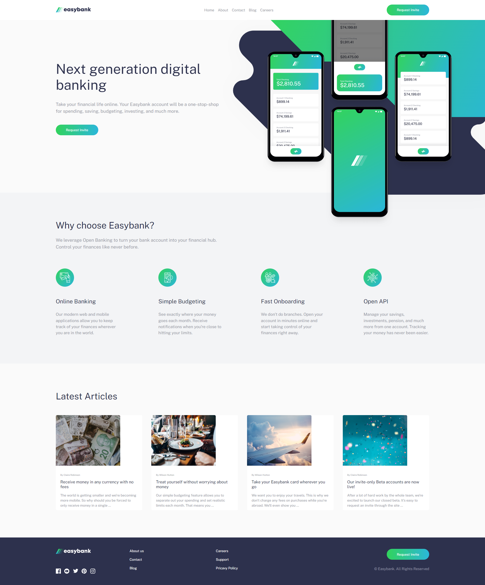
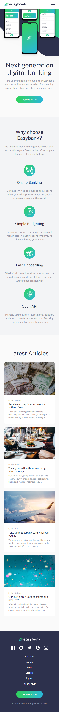

# Frontend Mentor - Easybank landing page solution

This is a solution to the [Easybank landing page challenge on Frontend Mentor](https://www.frontendmentor.io/challenges/easybank-landing-page-WaUhkoDN). Frontend Mentor challenges help you improve your coding skills by building realistic projects. 

## Table of contents

- [Overview](#overview)
  - [The challenge](#the-challenge)
  - [Screenshot](#screenshot)
  - [Links](#links)
- [My process](#my-process)
  - [Built with](#built-with)
  - [What I learned](#what-i-learned)
  - [Continued development](#continued-development)
- [Author](#author)

## Overview

### The challenge

Users should be able to:

- View the optimal layout for the site depending on their device's screen size
- See hover states for all interactive elements on the page

### Screenshot

Desktop:

Mobile:

### Links

- Live Site URL: [MarkVanweersch.GitHub.io](https://markvanweersch.github.io/easybank-landing-page/)
- Solution URL: [FrontendMentor.io](https://www.frontendmentor.io/solutions/easybank-landing-page-t8YfZV7CN_)

## My process

### Built with

- Semantic HTML5 markup
- CSS custom properties
- Flexbox

### What I learned

I learned more about how to plan out a website, to use utility classes and the picture element is not well suited for custom positioning.

### Continued development

I want to learn more about how to plan out a website, especially when multiple pages need to be made. Then it will become more important to have utility classes set up. This way components can easily be reused.

## Author

- Website - [Mark Vanweersch](https://markvanweersch.github.io/)
- Frontend Mentor - [@MarkVanweersch](https://www.frontendmentor.io/profile/MarkVanweersch)